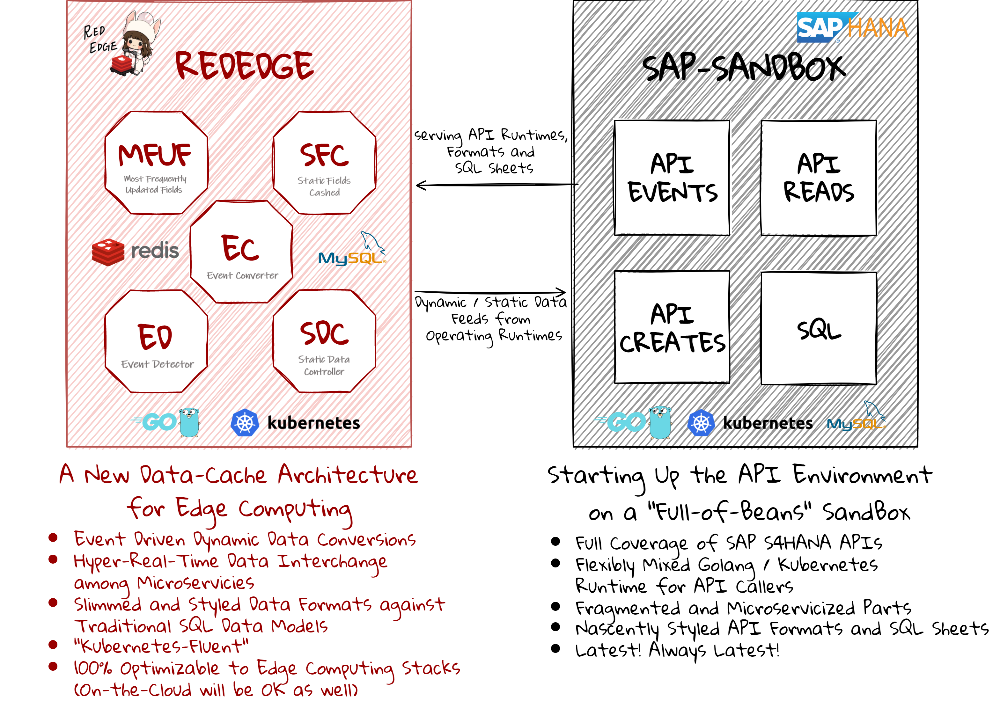

  
 
 Starting Up the API Environment on a "Full-of-Beans" SandBox 

***

# sap-sandbox-accounting  
sap-sandbox-accounting は、主にエッジコンピューティング環境において、会計に関する機能について、外部システムをSAPと統合することを目的として作成されたリソースをまとめたリポジトリです。  
sap-sandbox-accounting の 「sandbox」は、Netflix 韓国ドラマ 「START-UP」 より、すべての開発者のための 地ならし になればという想いから命名されました。  
なお、各リポジトリのリソースは、そのままクラウド環境におけるアプリケーションにも適用可能です。  

## 前提条件  
sap-sandbox-accounting は、オンプレミス版である（＝クラウド版ではない）SAPS4HANA API の利用を前提としています。  
クラウド版APIを利用する場合は、ご注意ください。  

## Latona における SAP 領域・機能ごと の リソース整備状況    
下の図において、チェックマークが付いているリソースが、Latonaにおいて(少なくとも1次の)整備が行われたものであり、github上に公開されています。  

## 各リソースの所在  
各リソースの所在は、次の箇所です。  

### Masters 
##### EVENTS

##### READS

##### CREATES

##### SQL

### Operations  
##### EVENTS

##### READS

*  [sap-api-integrations-accounting-document-reads](https://github.com/latonaio/sap-api-integrations-accounting-document-reads)
*  [sap-api-integrations-payment-requisition-reads](https://github.com/latonaio/sap-api-integrations-payment-requisition-reads)
 

##### CREATES

*  [sap-api-integrations-accounting-document-creates](https://github.com/latonaio/sap-api-integrations-accounting-document-creates)

##### SQL

* [sap-payment-requisition-sql](https://github.com/latonaio/sap-payment-requisition-sql)  

### Reports  
##### EVENTS
 

##### READS

 

##### CREATES

##### SQL
 

## sap-sandbox-accounting における SAP領域・機能 の選択基準
sap-sandbox-accounting におけるSAP領域・機能は、SAP S4HANA の会計に関する領域・機能のうち、世界中の企業で繰り返し利用され、利用頻度が高いと判断されるものが、選択されています。  

## SQL 作成の基準
sap-sandbox-accounting において ある機能 に対して SQL を 作成するかどうか は、次の基準に基づいて判断されています。  

* 外部システム側で当該機能の必要十分なデータ量を保持する要求が、平均的にあるかどうか  
* 当該機能の平均的要求に、外部システムから帳票を出力することが含まれるかどうか  

上記基準のいずれかに当てはまれば、sap-sandbox-accounting において SQL が作成され、該当するレポジトリが存在します。  
なお、SAP API Business Hub にて READ API が公開されていない機能については、sap-sandbox-accounting において SQL は作成されません。  

## Rededgeとの依存関係  
以下の図は、sap-sandbox-accounting と [rededge](https://github.com/latonaio/rededge) との依存関係を示した図です。（sap-sandbox-accounting は マイクロサービス であり、rededge と独立して動作します。rededge と組み合わせないと機能しないということではありません）    
sap-sandbox-accounting は、REDEDGE との統合に関連して、以下の機能を提供します。  

* Full Coverage of SAP S4HANA APIs（SAP S4HANA API の完全なカバレッジ）    
* Frexibly Mixed Golang / Kubernetes Runtime for API Callers（API Caller のための フレキシブルに組み合わせ可能な Golang / Kubernetes ランタイム）   
* Fragmented and Microservicized Parts（細かく刻まれマイクロサービス化された部品）  
* Nascently Styled API Formats and SQL Sheets（新生にスタイルされた APIフォーマット と SQLシート）  
* Latest! Always Latest!（リソースは常に最新の状態です！）  

  
